# How each agent works

AuditLens · Team 33 · one diagram per role, drawn from the code as it stands on
12 September 2026.

Read the first diagram for the shape of the whole system, then any single
section for the part you own.

---

## The whole pipeline

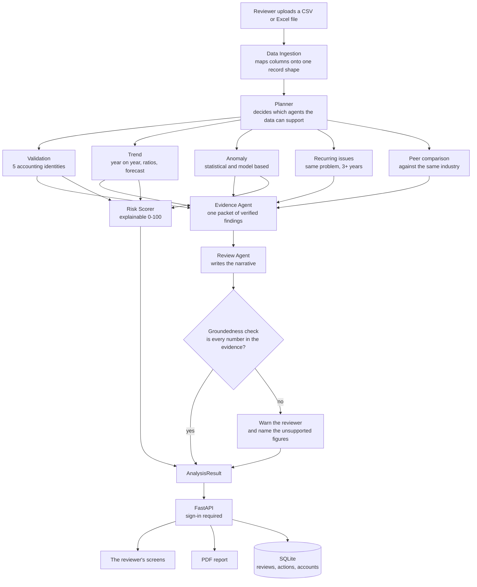

**The rule that shapes everything:** no figure is ever produced by a language
model. Every number is computed in ordinary Python, and the model is given only
figures already established as true. The groundedness check enforces it.

---

## 1. Data Ingestion

**Owner:** Data Ingestion · **Code:** `extraction/`

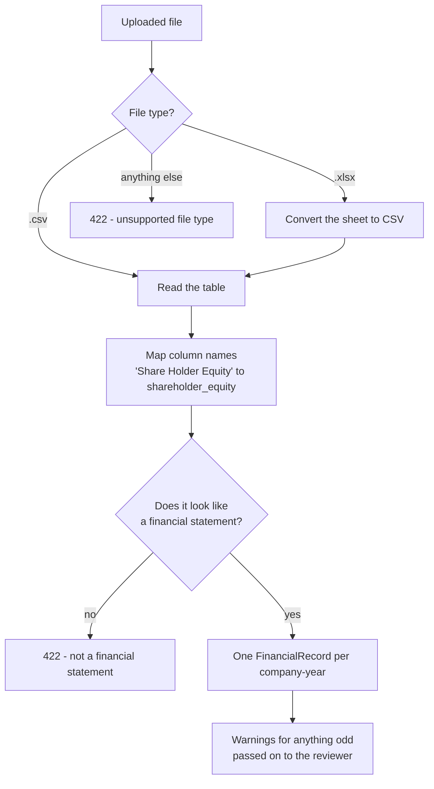

**Checked:** reads 480 of 480 rows from the dummy file with values matching the
source, and rejects a non-financial file rather than guessing.

---

## 2. Validation

**Owner:** Validation Agent · **Code:** `validation_agent/`

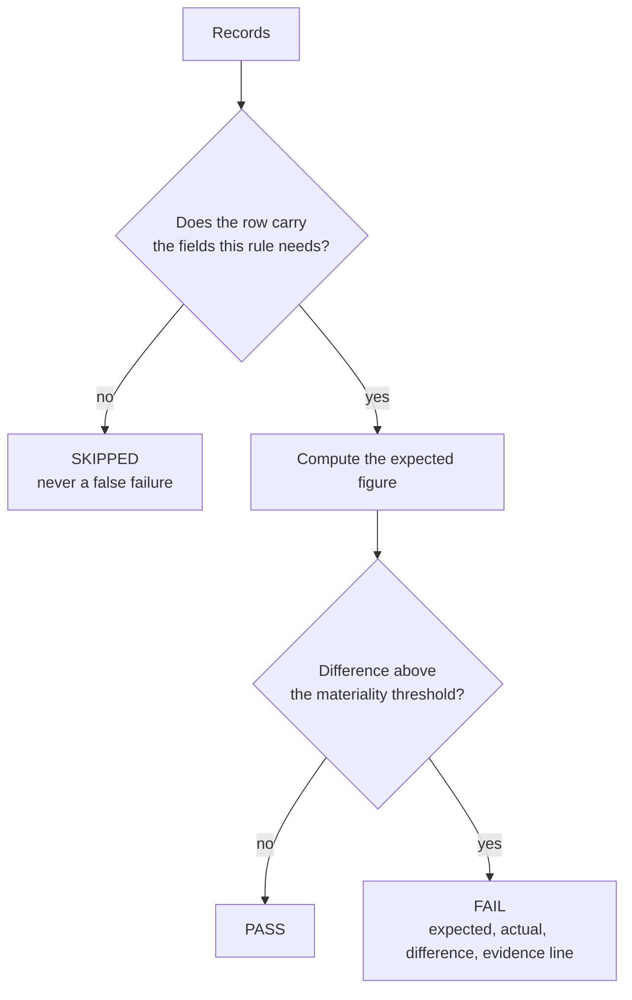

**The five identities**

| Rule | Identity |
|:--|:--|
| VAL_BS_01 | Total Assets = Total Liabilities + Equity |
| VAL_GP_02 | Gross Profit = Revenue − Cost of Revenue |
| VAL_OP_03 | Operating Income = Gross Profit − Operating Expenses |
| VAL_NI_04 | Net Income = Pre-tax Income − Taxes |
| VAL_CF_05 | Ending Cash = Beginning Cash + Operating + Investing + Financing |

**Checked:** catches 147 of 147 planted errors, with no false alarms on the
clean file.

---

## 3. Trend

**Owner:** Trend Agent · **Code:** `analysis/trend.py` and its neighbours

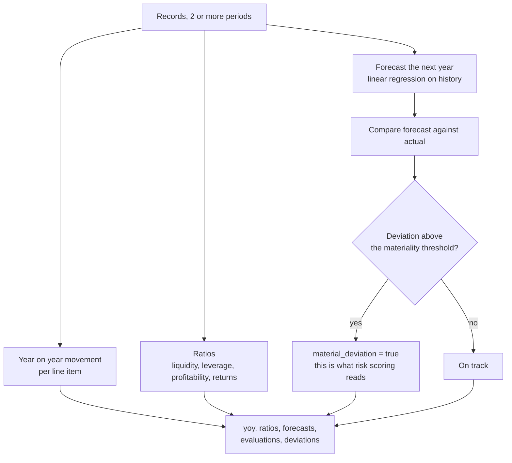

**Skipped when** the file has fewer than 2 periods — a movement needs two points.

**Checked:** revenue growth matches a hand calculation; 57 material deviations
on the defective file.

---

## 4. Anomaly

**Owner:** Anomaly Agent · **Code:** `finsight/`

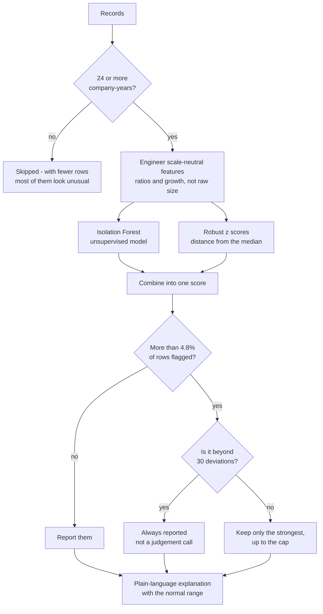

**Why the cap exists:** without it an ordinary file fills with borderline
findings. **Why the override exists:** the cap used to hide real ones — a file
with 10 blatant anomalies in 40 rows reported 2.

**Checked:** 5.0% flagged on clean data, the planted anomaly found, small
uploads skipped.

---

## 5. Recurring issues

**Owner:** Orchestration & API · **Code:** `analysis/recurring_issues.py`

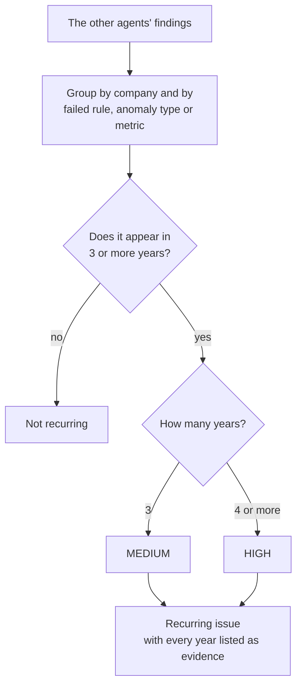

**Why it matters:** the same check failing for four years running is a
different problem from one bad year, and no single-year agent can see it.

**Checked:** finds 3 of 3 planted repeats, nothing extra, skips a 2-year file.

---

## 6. Peer comparison

**Owner:** Orchestration & API · **Code:** `analysis/peer_comparison.py`

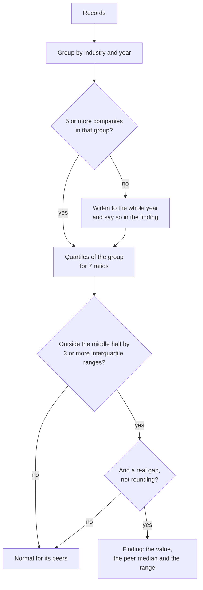

**Deliberately kept out of the risk score.** A specialist lender genuinely
carries more debt than a software firm; scoring that as a defect took clean
books from 44 MEDIUM to 82 CRITICAL.

**Checked:** 7% of company-years reported on clean data, planted outlier found.

---

## 7. Evidence Agent

**Owner:** Evidence & Review · **Code:** `evidence_agent/`, wired by `agents/evidence_agent.py`

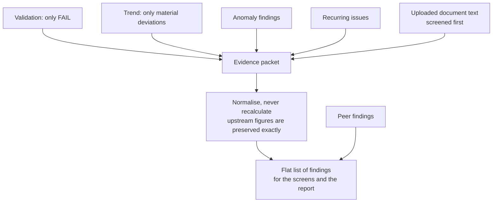

**The boundary:** this is the last step before the language model. Only
computed figures pass it, and only the screened version of any uploaded text.

---

## 8. Review Agent and the groundedness check

**Owner:** Evidence & Review, with Orchestration for the check
**Code:** `review_agent/`, `agents/review_agent.py`, `agents/groundedness.py`

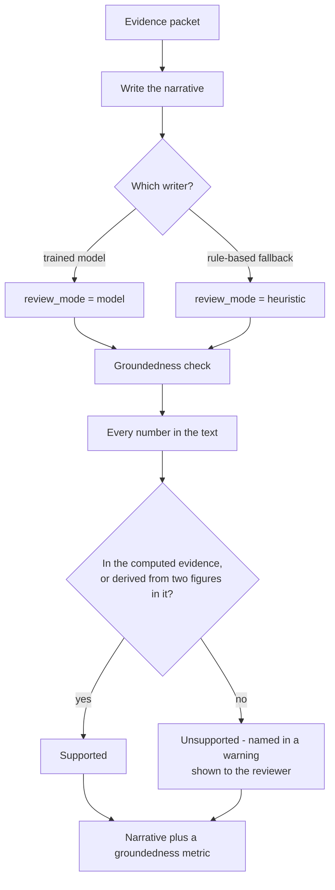

**Why the check exists.** Our own fine-tuned model, on a validation example,
wrote a cost of revenue of **75,670** where the input said **74,670** — right
prose, right conclusion, one invented digit. Measured across 180 examples,
12.3% of the numbers it produced were unsupported. So the narrative is checked
rather than trusted.

---

## 9. Risk scoring

**Owner:** Risk & Reporting · **Code:** `risk_reporting/risk_engine.py`

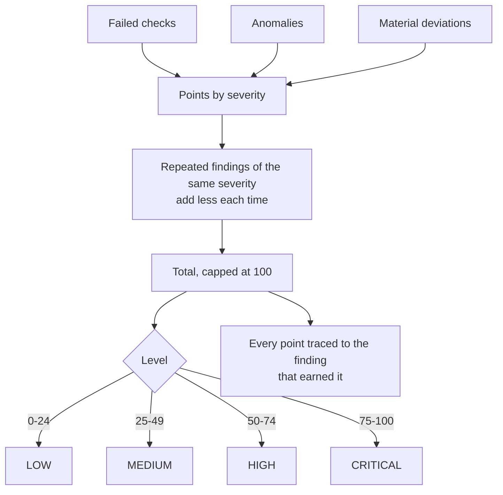

**Explainable by construction:** the contributors always add up to the score
shown, so a reviewer can ask "why 60?" and get a list.

**Checked:** clean file 44 MEDIUM, defective file 60 HIGH.

---

## 10. Reporting, history and monitoring

**Owner:** Risk & Reporting · **Code:** `database/`, `reports/`

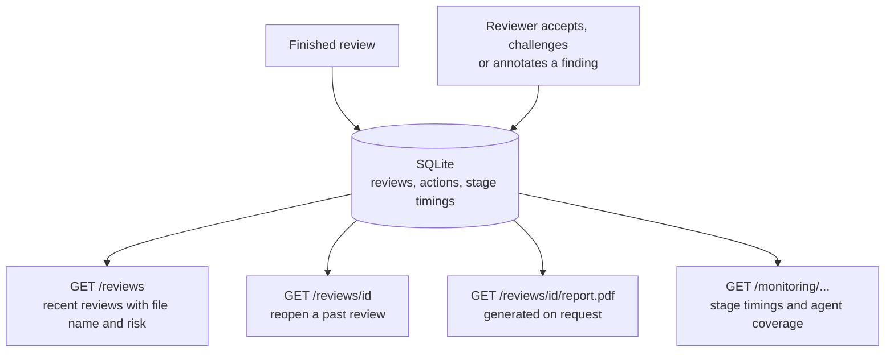

**Note for demo day:** the database lives inside the container, so reviews and
accounts reset on every deployment. Demo reviews are seeded automatically;
accounts are not.

---

## 11. Orchestration and API

**Owner:** Orchestration & API · **Code:** `agents/`, `api/`

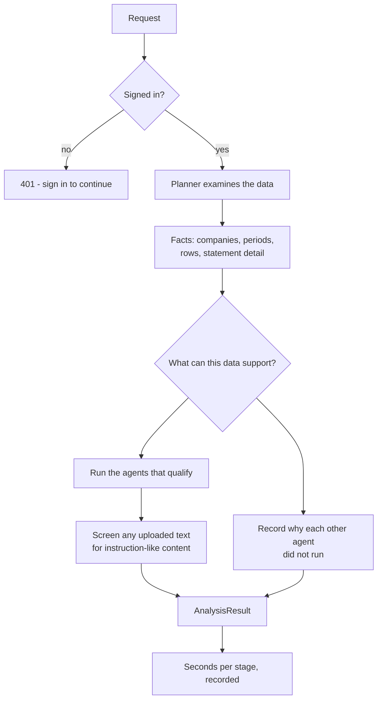

**Requirements each agent must meet**

| Agent | Needs |
|:--|:--|
| Validation | nothing — it skips checks whose inputs are missing |
| Trend | 2 or more periods |
| Anomaly | 24 or more company-years |
| Recurring | 3 or more periods |
| Peer | 5 or more companies |

**Why it matters:** a reviewer who sees no trend findings must know whether
there were none, or whether the agent never ran. The interface shows both.

---

## 12. The reviewer's screens

**Owner:** Frontend · **Code:** `ui/`

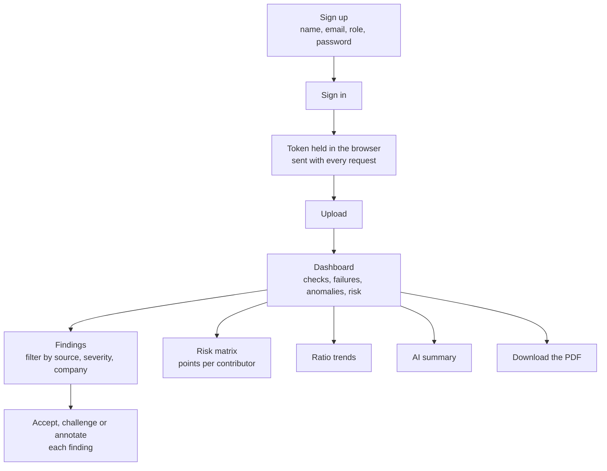

Served by the same container as the API, so the screens and the data share one
address and one sign-in.

---

## 13. Deployment

**Owner:** Orchestration & API · **Code:** `Dockerfile`, `docs/DEPLOYMENT.md`

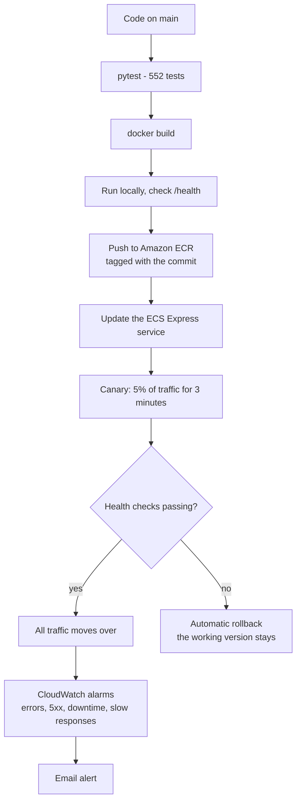

**Live:** one Fargate task behind an Application Load Balancer with HTTPS, in
`ap-south-1`. Every release in ECR is a rollback point.

---

## What the numbers were, last time everything ran

| Measure | Value |
|:--|:--|
| Tests | 552 passing |
| Agents passing their manual check | 10 of 10 |
| Findings on the 480-row defective file | 267 |
| — failed accounting checks | 147 |
| — material trend deviations | 57 |
| — anomalies | 24 |
| — recurring issues | 3 |
| — peer comparisons | 36 |
| Risk score | 60 HIGH, against 44 MEDIUM on the clean file |
| Review time | about 3 seconds |
